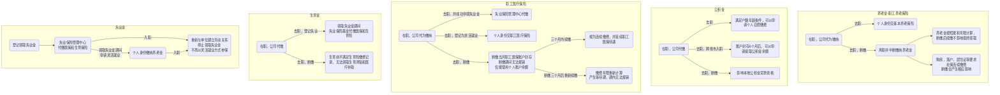

```mermaid
flowchart TD

subgraph 养老金-职工养老保险
在职养老金("在职，公司代为缴纳")-->|去职|灵活就业(个人身份交基本养老保险)
在职养老金-->|去职，断缴|离职断缴(离职并中断缴纳养老金)
离职断缴-->养老金年限("养老金按照累积年限计算，断缴后续缴不影响最终领取")
离职断缴-->社保其他影响("购房，落户，居住证等要求社保连续缴费<br>断缴会产生相应影响")
end

subgraph 公积金
在职公积金("在职，公司代缴")
-->|去职|个人申请缴费("满足户籍年龄条件，可以申请个人自愿缴费")
在职公积金-->|去职，跨省市入职|提取余额("账户封存6个月后，可以申请提取公积金余额")
在职公积金-->|去职，断缴|影响本地公积金贷款资格
end

subgraph 职工医疗保险
在职医保("在职，公司代为缴纳")-->|去职，并成功申领失业金|领取失业金(失业保险管理中心代缴)
在职医保-->|去职，登记为灵活就业|个人身份交职工医疗保险
在职医保-->|去职，断缴|中断医保缴费("断缴当月职工医保账户封存<br>断缴期间无法报销<br>仅能使用个人账户余额")-->|三个月内续缴|视为连续缴费("视为连续缴费，并延续职工医保待遇")
中断医保缴费-->|断缴三个月后重新续缴|视为中断缴费("缴费年限重新计算<br>产生等待期，期内无法报销")
end

subgraph 生育金
在职生育金("在职，公司代缴")-->|去职，登记失业|失业保险管理中心代缴("领取失业金期间<br>失业保险基金代缴医保和生育险")
在职生育金-->|去职，断缴|不享受生育津贴和医疗补助("生育前不满足生育险缴费记录，无法领取生育津贴和医疗补助")
end


subgraph 失业金
失业("登记领取失业金")
-->代缴医保("失业保险管理中心<br>代缴医保和生育保险")
-->|领取失业金期间<br>申请灵活就业|申请灵活就业("个人身份缴纳养老金")
代缴医保-->|入职|恢复雇佣关系(重新与单位建立劳动关系<br>停止领取失业金<br>不再以灵活就业方式参保)
申请灵活就业-->|入职|恢复雇佣关系
end
```
