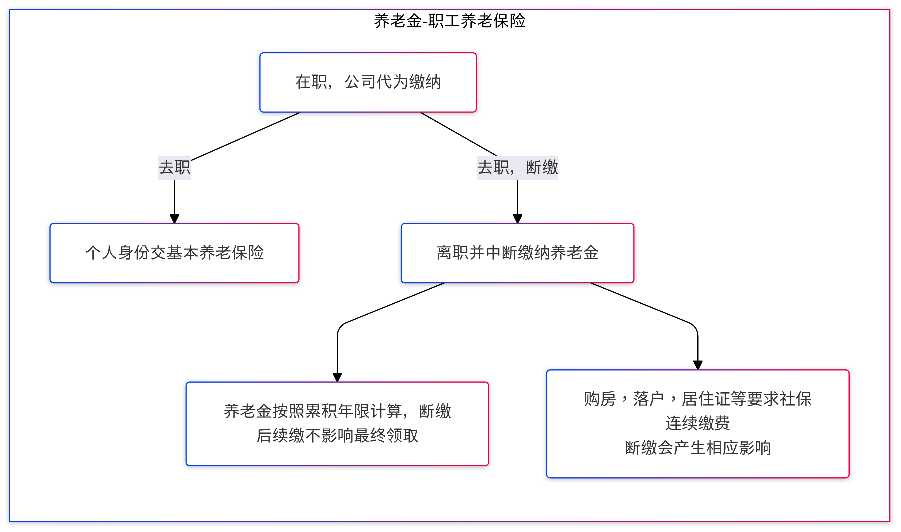

我希望在此梳理和社保福利，就职离职相关的常见问题，特别是各种基本保险的缴纳或者转移方式，以及断保的潜在后果。

如果有具体的问题，还请结合自己的个人条件，咨询各地的社保/医保服务机构。

能力所限，不能列尽政策的明细条款和办事步骤，如有疏漏，还请见谅。祝大家早日找到满意的工作。

### 目录
- [服务机构咨询入口](#服务机构咨询入口)
- [职工养老保险](#职工养老保险)
- [公积金](#公积金)
- [职工医疗保险](#职工医疗保险)
- [生育保险](#生育保险)
- [失业金](#失业金)
- [劳动手册/就业登记证/就业创业证](#劳动手册就业登记证就业创业证)
- [退工单/离职证明](#退工单离职证明)
- [个人所得税税务](#个人所得税税务)

### 服务机构咨询入口
------------------------
* 上海人力资源和社会保障局 https://rsj.sh.gov.cn/tmsztc_17502/index.html
  * 医保咨询热线 12393
  * 社保咨询热线 12333
* 上海公积金 https://www.shgjj.com/
  * 公积金热线 12329
* 上海税务局 https://shanghai.chinatax.gov.cn/

### 职工养老保险
------------------------
```diff 
+ 领取养老金计算的是累积缴费年数。若满足总年限，中途断缴不影响退休后领取养老金的数额
- 考虑落户，购房资格等，需要连续N月社保记录的同事，还请考虑以灵活就业的方式保证社保连续性
+ 社保咨询热线 12333
```



##### Q: 如果暂时求职未果，养老金断缴会有什么后果？
```
* 如果社保中断期间没有在用人单位工作的，则个人不能通过事后追补的方式进行补缴。
* 社保断缴不影响累计计算养老保险缴费年限，养老保险中断缴费前后的缴费年限是累计计算的，养老保险个人账户储存额也继续累积。
* 在单位就业期间应缴未缴的社保费才可以补缴，且由用人单位补缴。
* 对于落户/车牌/置业/公租房等，需要连续税收和社保证明的事项，社保中断都可能影响申请资质。
```
https://rsj.sh.gov.cn/trdhy_17355/20230616/t0035_1416294.html

##### Q: 换工作时，怎样才能不断缴社保？
```
* 一般情况下，当月15日之后离职，当月的社保原公司会给缴纳；下个月15日之前入职新公司，下月的社保新公司也会给缴。
* 如果是已经找好新工作再离职的情况，需要及时和新、老单位提前沟通，确认离职和入职以及社保增减员的时间，并提醒新单位在您入职后及时缴纳社保。
* 同一个月内在多家单位工作的，应由第一家单位缴纳社保费。职工离职后，当月马上入职新的单位，这个月的社保应当由原单位来缴纳。按照不重复缴费的原则，新单位从下月起为职工缴纳社保费。
```
https://rsj.sh.gov.cn/trdhy_17355/20221010/t0035_1410500.html

##### Q：职工养老保险跨省接续的比例是多少？
```
* 参考下文第四条
第四条　参保人员跨省流动就业转移基本养老保险关系时，按下列方法计算转移资金：
　　（一）个人账户储存额：1998年1月1日之前按个人缴费累计本息计算转移，1998年1月1日后按计入个人账户的全部储存额计算转移。
　　（二）统筹基金（单位缴费）：以本人1998年1月1日后各年度实际缴费工资为基数，按12%的总和转移，参保缴费不足1年的，按实际缴费月数计算转移
```
https://www.gov.cn/zwgk/2009-12/29/content_1499072.htm & https://rsj.sh.gov.cn/trdhy_17355/20210816/t0035_1401746.html

##### Q: 如果暂时求职未果，养老金是否能自己缴纳？
```
* 灵活就业人员实行按月缴费，不得以事后追补缴费的方式增加缴费年限。
```
https://rsj.sh.gov.cn/trdhy_17355/20241011/t0035_1428096.html
```
* 符合条件按灵活就业参保的人员，参加本市职工基本养老保险、职工基本医疗保险两险。
* 缴费基数在本市上年度全口径城镇单位就业人员月平均工资的60%至300%之间，由本人自行选择。月缴费标准为本人缴费基数乘以相应的比例。目前，本市灵活就业人员缴纳职工基本养老保险费的比例为24%，职工基本医疗保险费的比例为11%。
* 灵活就业人员参保缴费后，按照国家和本市规定记账并计算缴费年限。
```
https://rsj.sh.gov.cn/trdhy_17355/20230818/t0035_1417703.html

##### Q: 如果暂时求职未果，养老金自己缴纳，之后找到工作，灵活就业转为单位雇佣，社保如何转移？
```
* 单位或个人不得以任何违规形式(如双方签署约定等)由职工个人以灵活就业的方式参保。
* 个人需要先办理灵活就业停止缴费手续，在退出灵活就业参保方式后，用人单位就可以按在职职工的方式为职工办理就业参保。
```
https://rsj.sh.gov.cn/tmsztc_17502/20240821/t0035_1427197.html

```
* 用人单位应当自用工之日起三十日内为其职工向社会保险经办机构申请办理社会保险登记。
```
https://rsj.sh.gov.cn/tmsztc_17502/20240703/t0035_1425145.html

##### Q: 领取失业金期间，可以继续个人缴纳养老保险吗？
```
* 失业人员在领取失业保险金期间，可以个人身份缴纳基本养老保险费，未出现依法应当停止领取失业保险金情形的，经办机构不得停发失业保险待遇。
```
https://www.gov.cn/zhengce/202405/content_6951032.htm
```
* 灵活就业人员可以以个人身份参加城镇职工养老保险
根据《社会保险法》规定，失业人员重新就业的，停止发放失业保险金。
判定失业人员是否重新就业以用人单位是否为其缴纳社会保险费为标准确定。因此，失业人员在打零工期间只要没有新的用人单位为其参加社会保险就不属于失业保险上的“重新就业”，可以继续领取失业保险金。
```

https://m12333.cn/qa/muryz.html

##### Q：职工养老保险和居民养老保险的区别是什么？可以合并计算退休金吗？
```
* 企业职工养老保险缴费水平较高，待遇水平也相对较高；城乡居民养老保险缴费水平相对更低，待遇水平也相对更低。
* 灵活就业人员养老保险本质上也是“职工养老保险”。
* 以上的讨论都属于职工养老保险范畴。
```
https://m12333.cn/qa/puz.html

* 从居民养老保险转入职工养老保险的，居民养老保险个人账户全部储存额并入职工养老保险个人账户，居民养老保险缴费年限 _**不合并**_ 计算或折算为职工养老保险缴费年限。
* 反之，从职工养老保险转入居民养老保险的，职工养老保险个人账户全部储存额并入居民养老保险个人账户，职工养老保险的缴费年限 _**合并**_ 计算为居民养老保险缴费年限。

https://m12333.cn/qa/mmfbd.html

### 公积金
------------------------
```diff 
- 考虑在上海置业的同学请考虑连续足额缴存住房公积金达到规定期限(6个月)方可申请公积金贷款。
+ 符合户籍年龄条件，如果暂未入职，可以申请个人自愿缴费，并在录用后转移公积金账户。
+ 如果新工作在别的省市，公积金账户封存6个月后，可以提取余额。
+ 公积金热线 12329
```


##### Q：在其他省市入职新工作后，怎样提取上海公积金账户的余额？
```
* 异地入职后提取公积金账户余额，需要满足6个月的封存条件。
* 手续在随申办上可以直接申请。
```
https://www.shgjj.com/html/newxxgk/ywzn/sytq/209078.html & https://m.sh.bendibao.com/zffw/286097.html

##### Q：如果求职成功，公积金如何转账户？
参考条例 - 公积金账户转移一般由单位负责注销/变更登记。

* （十四条）单位合并、分立、撤销、解散或者破产的，应当自发生上述情况之日起３０日内由原单位或者清算组织到住房公积金管理中心办理变更登记或者注销登记，并自办妥变更登记或者注销登记之日起２０日内持住房公积金管理中心的审核文件，到受委托银行为本单位职工办理住房公积金账户转移或者封存手续。
* （十五条）单位录用职工的，应当自录用之日起３０日内到住房公积金管理中心办理缴存登记，并持住房公积金管理中心的审核文件，到受委托银行办理职工住房公积金账户的设立或者转移手续。
* 单位与职工终止劳动关系的，单位应当自劳动关系终止之日起３０日内到住房公积金管理中心办理变更登记，并持住房公积金管理中心的审核文件，到受委托银行办理职工住房公积金账户转移或者封存手续。

https://rsj.sh.gov.cn/tgwyxzfgwj_17255/20200617/t0035_1388271.html

##### Q：如果暂时求职未果，公积金能否自己缴纳？求职成功后，如何转移？
```
* 具有上海市户籍，男性未满60周岁、女性未满55周岁的个体工商户及其雇员、非全日制就业人员以及其他灵活就业人员，可以自愿申请缴存住房公积金。
* 1. 办理自愿缴存签约时，个人住房公积金账户状态应为封存状态，或者无个人住房公积金账户。
* 2. 自愿缴存首次缴存年月为签约日的次月。
* 3. 签约当月及之前的年月不做自愿缴存补缴。
```
https://www.shgjj.com/html/newxxgk/ywzn/jc/zyjc/209074.html#a1

* 自愿缴存户转移（从“自愿缴存住房公积金账户”到录用单位）步骤如下。
https://www.shgjj.com/html/newxxgk/ywzn/jc/zyjc/209074.html#a5

### 职工医疗保险
------------------------
```diff
- 请务必保持医保的连续缴纳记录，一般为3个月，以避免造成断保；断保和等待期间就医无法享受医保报销。
- 考虑落户，购房资格等，需要连续N月社保记录的同事，还请考虑以灵活就业的方式保证社保连续性，或联系社保/医保咨询热线
+ 如领取失业金，失业保险中心将代缴医疗保险和生育险。
+ 如需临时更换居住地，之后回到上海求职的同事，可以考虑异地就医备案
+ 医保咨询热线 12393；社保咨询热线 12333
```


##### Q：如果暂时求职未果，医保断缴会有何种后果，能否补缴？
```
* 单位停止缴纳医疗保险费的次月15日起，职工的个人医疗保险帐户封存；个人医疗帐户中剩余资金就医时可继续使用，用完为止，不享受其他有关医保报销待遇。
* 职工医保断缴三个月内未续交的，将视为缴费记录中断；重新续交后，享受医保待遇需要有6个月等待期。
* 断保续交后，连续缴费年限将重新计算，可能影响报销比例。
```
* https://www.gov.cn/zhengce/202408/content_6969916.htm
* https://service.shanghai.gov.cn/XingZhengWenDangKuJyh/XZGFDetails.aspx?docid=REPORT_NDOC_002831


##### Q：如果暂时求职未果，医保金能否自己缴纳，有哪些方式？
```
* 方法一，参加居民基本医疗保险。符合参保条件的人员携带相关材料至就近的社区事务受理服务中心医保窗口办理参保手续，参保需要缴费。
* 方法二，申领失业保险金。失业人员在领取失业保险金期间，由上海市失业保险管理中心负责统一为失业人员办理参加职工医保（含生育保险）的缴费手续，失业人员个人不缴费
* 方法三，也可以按照灵活就业的方式，继续以个人身份交职工医保
```
https://rsj.sh.gov.cn/tmsztc_17502/20200617/t0035_1379217.html

* 居民医保和我们目前参加的职工医保的区别
https://www.51shebao.com/article/detail/7275


##### Q: 如果在其他省市入职，如何享受医保待遇
```
更换参保地，上海市医疗保险转移步骤：
第一步，完成基本养老保险关系从本市转移至外省市手续。
第二步，向新参保地的医保经办机构提出医保关系转入申请。
```
https://rsj.sh.gov.cn/trdhy_17355/20210816/t0035_1401746.html & https://m12333.cn/qa/ppfwp.html

##### Q: 如果更换居住地，该如何在此期间享受医保待遇
适合选择短期内离开上海生活，并回到上海继续工作的同事，以便在离沪期间按比例报销门诊费用。未备案的异地就医可能影响报销比例，或者需个人垫付全额费用。
```
* 不改变医保参保地，可以根据自己的目的地和居住期限，申请异地就医备案，备案期间回到上海就医也不影响医保待遇。
```
https://hsa.gd.gov.cn/zwdt/ywsd/content/post_4193049.html & https://si12333.cn/qa/puwbf.html

### 生育保险
------------------------
```diff
- 生育保险不能以个人身份单独缴纳，一般合并在职工医疗保险内由公司代缴
- 按照上海市规定，生育前需要连续缴纳9个月或累积交12个月生育险，才能报销生育保险和生育津贴
+ 若满足上述连续缴费条件，在领取失业金期间生育，也可以领取生育津贴
* 社保咨询热线12333
```
* https://m12333.cn/qa/miuss.html


### 失业金


##### Q：如果暂时求职未果，失业金的领取标准和领取时间如何？如果找到了工作，如何暂停领取失业金？
```
* ①用人单位和本人已经缴纳失业保险费满一年的；②非因本人意愿中断就业的；③已经进行失业登记，并有求职要求的。
* 本市符合上述条件的领取对象范围包括：本市户籍失业人员、失业保险最后参保地在本市的非本市户籍失业人员。
```
https://rsj.sh.gov.cn/trdhy_17355/20240809/t0035_1426989.html
```
* 领取失业保险金的人员应当在入职新单位当月办理失业金暂停手续。
```
https://rsj.sh.gov.cn/trdhy_17355/20241011/t0035_1428097.html
```
* 2024年7月1日规定，符合领取失业保险金条件的失业人员，按下列标准计发失业保险金。
```
https://rsj.sh.gov.cn/tzcjd_17352_17352/20240628/t0035_1425029.html

##### Q: 失业金可以跨省转移吗？
```
* 根据现行政策，以下人员可以办理失业保险关系跨省转移接续：
❶ 参保职工跨省就业的，失业保险关系应随之转迁，缴费年限累计计算。
❷ 参保失业人员符合领取失业保险金条件的，在最后参保地申领失业保险金及其他相关待遇，也可以选择回户籍地申领，待遇发放期间不得中途变更发放地。选择户籍地申领的，须办理失业保险关系转移。
❸ 对不符合领取失业保险金条件、符合领金条件但未申领，以及正在领金期间的参保失业人员，跨省重新就业并参保的，失业保险关系应随之转移至新参保地，缴费年限累计计算。
```
https://m12333.cn/qa/mabkz.html

##### Q: 失业保险金能异地申领吗？
可以在[国家社保平台网站](./https://m12333.cn/platform/mya.html)。微信也可以申领，搜索“电子社保卡”小程序，进入首页，点击“失业保险待遇申领”服务。
* https://m12333.cn/qa/pwwds.html

### 劳动手册/就业登记证/就业创业证
------------------------
##### Q：劳动手册/就业失业登记证/就业创业证，该如何保管？
《劳动手册》是比较早期的叫法，曾改名为《就业失业登记证》，而现在已更名为《就业创业证》。不同年龄段的人可能叫法不同，但都是同一个意思。
```
* 劳动手册仍然可以办理各种公共服务。不需要特意更换就业创业证。
* 一般而言，劳动者在被用人单位招用期间，《就业创业证》由用人单位代为保管，用人单位应在《就业创业证》上，为劳动者做好劳动合同期限情况的记载；
* 劳动者在自主创业、灵活就业或失业期间，《就业创业证》由本人自行保管
```
https://rsj.sh.gov.cn/trdhy_17355/20210916/t0035_1402561.html

### 退工单/离职证明
------------------------
##### Q：退工单/离职证明该如何开具，保留？应包含哪些信息？
```
* 退工单是证明失业身份的重要资料，一般是一式四联的退工证明。
* 其中，第一联由受理退工登记备案手续的职介机构留存;第二联为退档凭证存入劳动者个人档案;第三联交被退工的劳动者本人;第四联由用人单位留存。退工单上记载了辞职的时间，这和缴纳失业保险的时间是一致的。
* 离职证明，是用人单位与劳动者解除劳动关系的书面证明，是用人单位与劳动者解除劳动关系后必须出具的一份书面材料。
```
https://m.gaodun.com/wenda/zonghe/96900.html

* 企业退工登记
https://zwdt.sh.gov.cn/govPortals/bsfw/item/9cb00316-c6eb-4942-b55a-1746a63c5cd4

### 个人所得税税务
------------------------
##### Q：离职后，如何解除办税人关系？
如下链接 https://shanghai.chinatax.gov.cn/hdjl/lygk/202409/t473545.html
